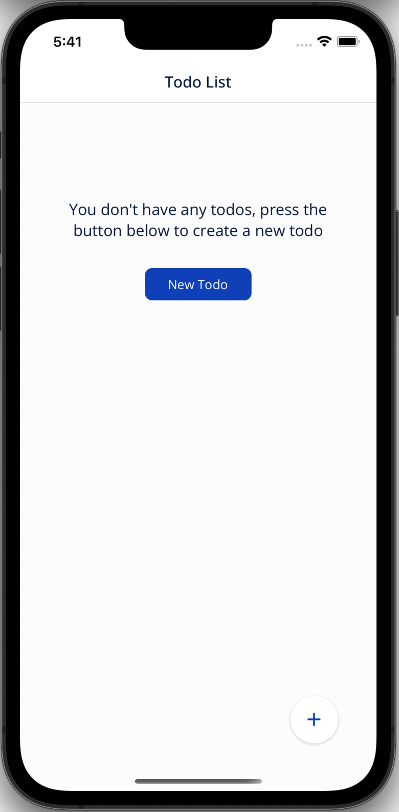
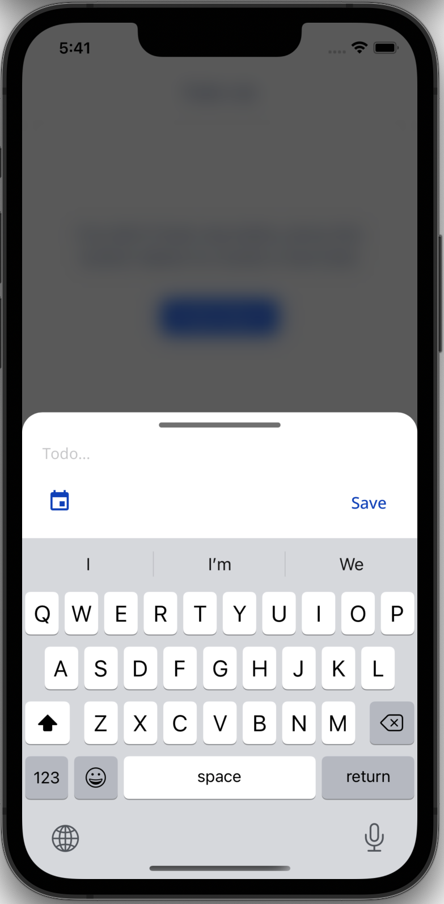
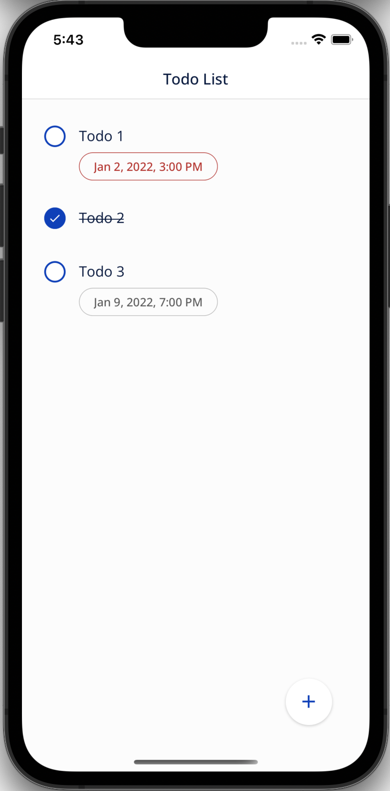
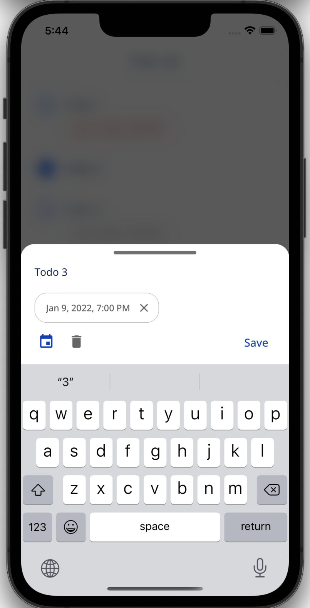

# Minimal Todo
Minimal Todo is a simple todo app with a minimal set of features
- Written in Typescript
- [apollo client](https://www.apollographql.com/docs/react/) is used as GraphQL client
- [apollo-server](https://www.apollographql.com/docs/apollo-server/) is used as GraphQL server
- [level](https://github.com/Level/level) is used for data persistent on the backend
- [react-hooks-global-state](https://github.com/dai-shi/react-hooks-global-state) for global state management
- [react-navigation](https://reactnavigation.org/) for navigation
- [react-i18next](https://react.i18next.com/) for internationalization i18n

### Features
- Create todo with title and due date
- Complete a todo
- Update todo's title and due date
- Delete todo

### Screenshots
Empty todo list            |Create todo            |View todo list            |Update todo
:-------------------------:|:-----------------------------:|:-------------------------:|:-------------------------:
  |    |    |  

### How to run the app locally
1. start the local backend server `npm run start:backend-local`
2. run the app on the simulator/emulator
   - to run the app on iOS, run `npx pod-install` then run `npm run ios`
   - to run the app on Android, run `npm run android`

### Unit tests
these components/custom hooks that have unit test coverage

##### Components
- [TodoDueDate.tsx](./src/client/todo/components/TodoDueDate.tsx)
: [TodoDueDate.test.tsx](./src/client/todo/components/__tests__/TodoDueDate.test.tsx)
- [NewTodoButton.tsx](./src/client/todo/components/NewTodoButton.tsx)
: [NewTodoButton.test.tsx](./src/client/todo/components/__tests__/NewTodoButton.test.tsx)
- [NewTodoFloatingButton.tsx](./src/client/todo/components/NewTodoFloatingButton.tsx)
  : [NewTodoFloatingButton.test.tsx](./src/client/todo/components/__tests__/NewTodoFloatingButton.test.tsx)

##### Custom hooks
- [useIsNewTodoInputVisible.ts](./src/client/todo/hooks/useIsNewTodoInputVisible.ts)
  : [useIsNewTodoInputVisible.test.ts](./src/client/todo/hooks/__tests__/useIsNewTodoInputVisible.test.ts)
- [useTodoList.ts](./src/client/todo/hooks/useTodoList.ts)
  : [useTodoList.test.ts](./src/client/todo/hooks/__tests__/useTodoList.test.ts)
